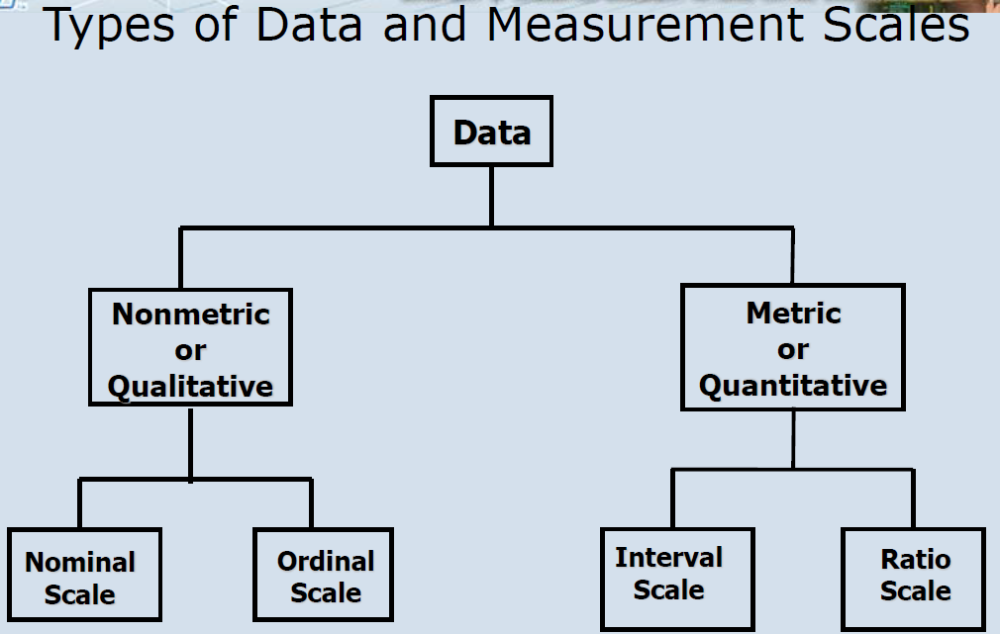
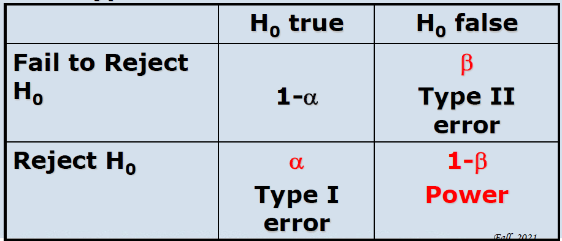
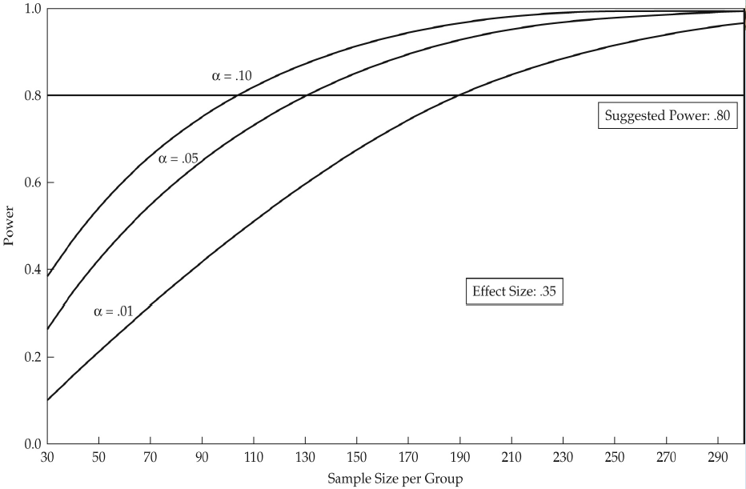
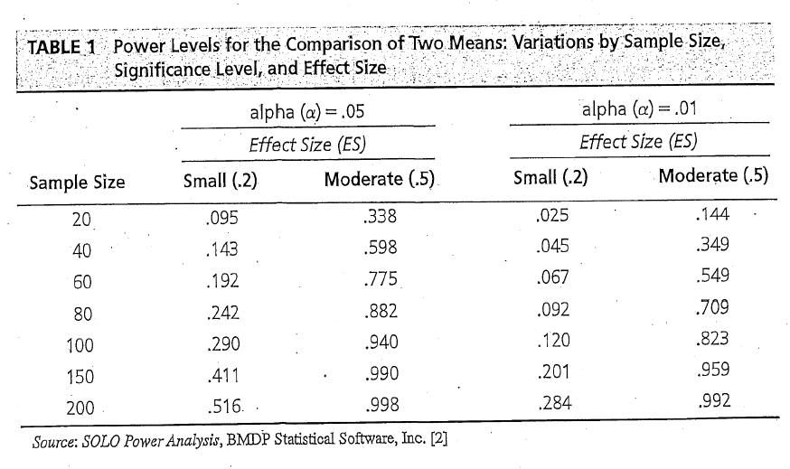

[TOC]

# Lecture 1

## Questions
什麼是多變量分析
- 所有變數一定要是隨機且變數之間要存在互相關聯(不然就要分成兩個問題)
- 個別效應難以被有意義地分開詮釋
- 工具主義：只要能夠預測，不管為什麼/原理。
- 無法提供學理上的解釋
- 幫助決策、假說驗證

Big Data
- Volume (量大)
- Variety (多樣性)、高速 (velocity)、真實性 (veracity)、快速變動性(variability)、價值(value)
- 樣本越大，統計推論的需求就越少；直接處理母體，沒有統計推論的需求(e.g., 就不用管例如confidence level那些)。
- 衝擊
  - 組織決策與學術研究
  - 分析方法與分析者: 處理看似無限量的資料

資料分析的兩支 Two distinctive approach
- Statistical/data model
  - 重點在解釋
  - 模型基於理論 > 分析資料 > 檢驗理論
  - 統計推論(樣本推母體數量特徵)以及用統計檢定檢驗模型的概化能力
  - 特定模型的建立: e.g. dependent variables and independent variables to be analyzed by the general linear model
- Datamining/Algorithmic model 
  - 重點在預測的精確度
  - 模型基於算法(例如 神經網路、決策樹)
  - 分析資料> 得到關係(模型)
  - 不重解釋與統計推論

**Also see:** 投影片表格!

Causal Inference 因果關係
- 在不做實驗的情況下得到超越統計推論的「原因-後果 的論述」

Variate
- a linear combination of variables with empirically determined weight
- $Y = W_1X_1+W_2X_2+W_3X_3+...+W_nX_n$
  - e.g., $X_1=$ income; $X_2=$ education;...

| $Y$   | $X_1$ | $X_2$ | ... | $X_n$ |
| --- | ----- | ----- | --- | ----- |
| ... | ...   | ...   | ... | ...   |
| ... | ...   | ...   | ... | ...   |
| ... | ...   | ...   | ... | ...   |

### Measurement scale
- Non-metric (qualitative) scale
  - nominal, categorical, i.e., 類別的；編號與順序或量化值無關。
  - ordinal, e.g., 10%-20%...; 前10%...; 順序代表測量到的特徵強弱，但不能反映強多少/弱多少。例如：非常喜歡-喜歡-普通-討厭-非常討厭
  - 不可轉成metric scale
- Metric scale
  - numerical, quantitative
    - Interval：例如溫度，有序(數值能夠比較)、等距(10$^\circ$C-20$^\circ$C區間與20$^\circ$C-30$^\circ$C)
    - Ratio # TODO: See this https://www.questionpro.com/blog/nominal-ordinal-interval-ratio/
  - 可轉成Non-metric scale

$H_0$ true: 虛無假設是正確的，即**沒有關係**
$H_0$ false: 虛無假設(沒有關係)是錯的，即**有關係**
Type I error: 沒有關係說成有關係的機率
Type II error: 有關係說成沒關係的機率

Sample Size太大的時候，一點小影響/差異/變化都可能會是統計顯著。**不能用於Big Data**。
要觀察的影響很小的時候，則需增加Sample Size以達到足夠的Power。

TODO: SEE https://hbr.org/2016/02/a-refresher-on-statistical-significance

- MANOVA
  - 多個 dependent variables: Multiple (metric) = Multiple (nonmetric)
- ANOVA
  - 單個 dependent variables: Single (metric) = Multiple (nonmetric)
- Multiple Discriminant Analisys
  - 跟cluster analysis 有異曲同工之妙。
- 結構方程
  - 具有多個方程式；每個方程式(模型)都要被滿足。
  - 同時估計不同假說下的模型。

### Problems
- 不能取代理論的建立
- 產生指引(guidelines)

### Guidelines for multivariate analysis
- 建立實務(practical) 顯著性：(?)需較高的 effect size
- 追求簡約(parsimony)：找到少數關鍵的因子(變數)。理論(概念模型^[cpt])是限制研究範圍的重要的工具。

[^cpt]: See "Strive for Model Parsimony", p35 of Lecture Ch1

### Validate Your Result
越複雜的模型(關係/interrelationships)，常常意味著這個模型只適合特定的樣本群，難以概化(generalizable)。
  - 改善：增加每個估計的觀測資料、分割資料集、...

"分析樣本回推母體"：
- 目標是建立一個能描述母體(the population as a whole)的模型(model)，並非找到"best fit"。
- 樣本需對母體要有代表性。

### 步驟
- 特定出概念、背後理論
- 概念模型不需要太複雜或有太多細節
- 分析規劃
  - 例如，需要至少或大概什麼規模的sample size